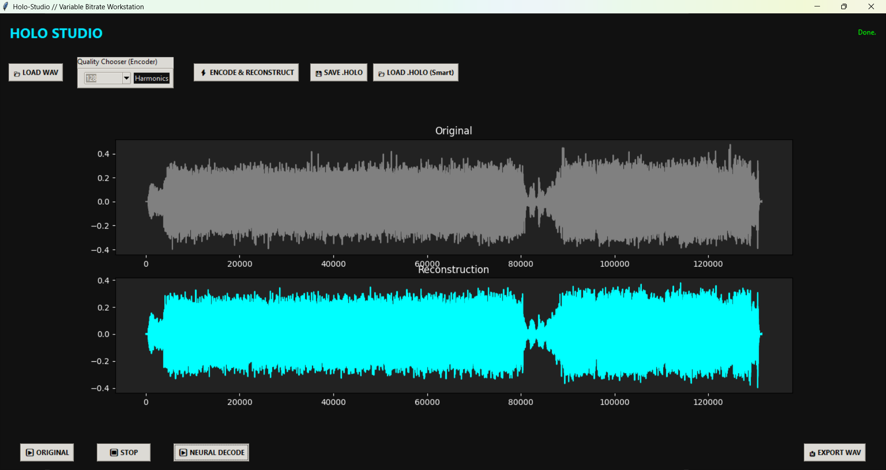

# HOLO-Audio — Geometric Neural Audio Codec



HOLO-Audio is a PyTorch-based **neural audio codec** that treats audio as a **geometric / harmonic interference pattern** rather than a raw waveform.

Instead of storing PCM samples or using fixed transforms (MP3/DCT), HOLO-Audio trains a **harmonic neural encoder–decoder** that learns a compact *Phase & Amplitude representation* ("Harmonic DNA") from which audio can be reconstructed.

This repository contains both:
- a **model factory** (trainer)
- a **GUI studio** for encoding, decoding, and playback

---

## 🧠 Core Ideas

### Harmonic Neural Representation
- Uses **sine activations** instead of ReLU to force the network to model **periodicity**
- Encoder maps audio chunks → `(phase, amplitude)` harmonic coefficients
- Vocoder reconstructs waveform chunks from those coefficients

### Holographic Compression
- Audio is stored as **neural instructions** (quantized latent vectors)
- `.holo` files contain:
  - Harmonic tier
  - Sample rate
  - Quantized latent DNA
- Decoder model reconstructs waveform on demand

### Variable Harmonic Tiers (VBR)
Lower tiers = extreme compression, higher tiers = fidelity.

| Harmonics | Typical Result |
|----------:|----------------|
| 4–8       | Sine-wave speech / abstract tones |
| 16        | Robotic but rhythmic |
| 32        | Intelligible speech |
| 64        | Clear speech |
| 128       | High fidelity |
| 256       | Near-lossless texture |

---

## Benchmarks

Tested on 17-minute audio sample (44.1kHz) using automated metrics suite.

(Holo_metrics.py) 


### Quality vs Compression

| Harmonics | SNR (dB) | PSNR (dB) | Envelope Correlation | Bitrate (kbps) | Compression Ratio |
|-----------|----------|-----------|----------------------|----------------|-------------------|
| 16 | 5.27 | 29.21 | 0.937 | 6.2 | 114x |
| 32 | 8.61 | 32.56 | 0.981 | 13.1 | 54x |
| 64 | 15.26 | 39.21 | 0.991 | 23.8 | 30x |
| 128 | 18.73 | 42.67 | 0.995 | 46.2 | 15x |
| 256 | 18.86 | 42.80 | 0.995 | 75.1 | 9x |

### Perceptual Metrics

| Harmonics | Log Spectral Distance (dB) | Transient Preservation | Phase Coherence |
|-----------|----------------------------|------------------------|-----------------|
| 16 | 22.36 | 17.0% | 0.345 |
| 32 | 21.52 | 28.4% | 0.368 |
| 64 | 19.20 | 44.1% | 0.371 |
| 128 | 17.94 | 56.4% | 0.385 |
| 256 | 17.75 | 57.5% | 0.377 |

### Key Findings

**Strengths:**
- Excellent envelope preservation (0.99+ correlation at 64H and above)
- Extreme compression ratios at low tiers (114x at 16H)
- Smooth quality scaling across harmonic tiers

**Current Limitations:**
- Transient preservation needs improvement (56% at 128H)
- Phase coherence is limited (~0.38 across all tiers)
- Diminishing returns above 128 harmonics

### Reference Comparison

| Codec | Typical Bitrate | Typical SNR |
|-------|-----------------|-------------|
| MP3 128 kbps | 128 | 15-20 dB |
| MP3 320 kbps | 320 | 25-30 dB |
| Opus 64 kbps | 64 | 20-25 dB |
| HOLO 128H | 46 | 18.7 dB |
| HOLO 64H | 24 | 15.3 dB |

### Interpretation

- SNR above 20 dB: Generally good quality
- SNR above 30 dB: Hard to distinguish from original
- Envelope Correlation above 0.95: Excellent dynamic preservation
- The 128H tier achieves near-MP3-128 quality at roughly 1/3 the bitrate
- Low tiers (16-32H) function as "sine wave speech" - intelligible but abstract

## 📊 Compression Characteristics

- Compression depends on **harmonic tier**, not bit-rate
- Lower tiers rely on the brain’s ability to infer speech (Remez-style sine speech)
- Higher tiers capture breath, transients, and texture
- `.holo` files are zlib-compressed latent tensors

> Note: This is **not entropy-optimal compression** yet. It is a *neural geometric codec*.

---

## 📂 Repository Structure

```
.
├── holostudio.py          # GUI studio (encode / decode / playback)
├── holomodeltrainer.py    # Model factory (trains all harmonic tiers)
├── holo_model_h*.pth      # Trained decoder/encoder checkpoints
├── training_data/         # WAV/MP3 training audio
└── *.holo                 # Compressed holographic audio files
```

---

## 🚀 Quick Start

### 1. Install Requirements

```bash
pip install torch numpy soundfile sounddevice matplotlib
```

CUDA is **highly recommended** for training.

---

### 2. Train the Models

Put `.wav` or `.mp3` files into:

```
training_data/
```

Then run:

```bash
python holomodeltrainer.py
```

This will generate:

```
holo_model_h4.pth
holo_model_h8.pth
...
holo_model_h256.pth
```

Each file is a **decoder/encoder pair** for a specific harmonic tier.

---

### 3. Run the Studio

```bash
python holostudio.py
```

Features:
- Load WAV / MP3
- Select harmonic tier
- Encode + reconstruct
- Save `.holo`
- Load `.holo` with automatic tier switching
- Playback original vs neural reconstruction
- Export reconstructed WAV

---

## 🧬 File Format: `.holo` (V2)

Each `.holo` file contains:

- Magic header (`HOLO`)
- Format version
- Harmonic tier
- Sample rate
- Quantization range
- Latent tensor shape
- zlib-compressed DNA payload

The file **does not store audio**, only reconstruction instructions.

---

## 🔬 Theoretical Background

This project draws inspiration from:

- **Sine-Wave Speech** (Remez et al., 1981)
- **Implicit Neural Representations**
- **SIREN networks**
- Harmonic / interference-based views of cognition and perception

The working hypothesis is that **intelligence and perception are fundamentally harmonic systems**, and that constraining neural networks to oscillatory bases forces them to learn *structure* instead of noise.

---

## ⚠️ What This Is / Is Not

**This IS:**
- A neural vocoder + codec experiment
- A variable-rate harmonic representation
- A perceptual / geometric audio model

**This is NOT:**
- A drop-in replacement for MP3/Opus
- Bit-perfect lossless compression
- Entropy-optimized (yet)

---

## 📜 License

MIT License
